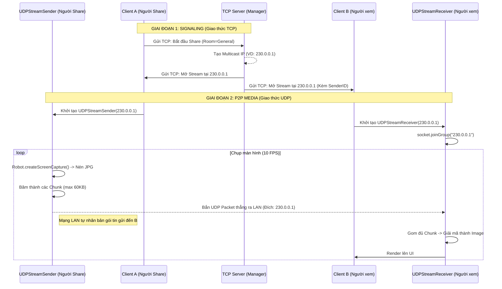
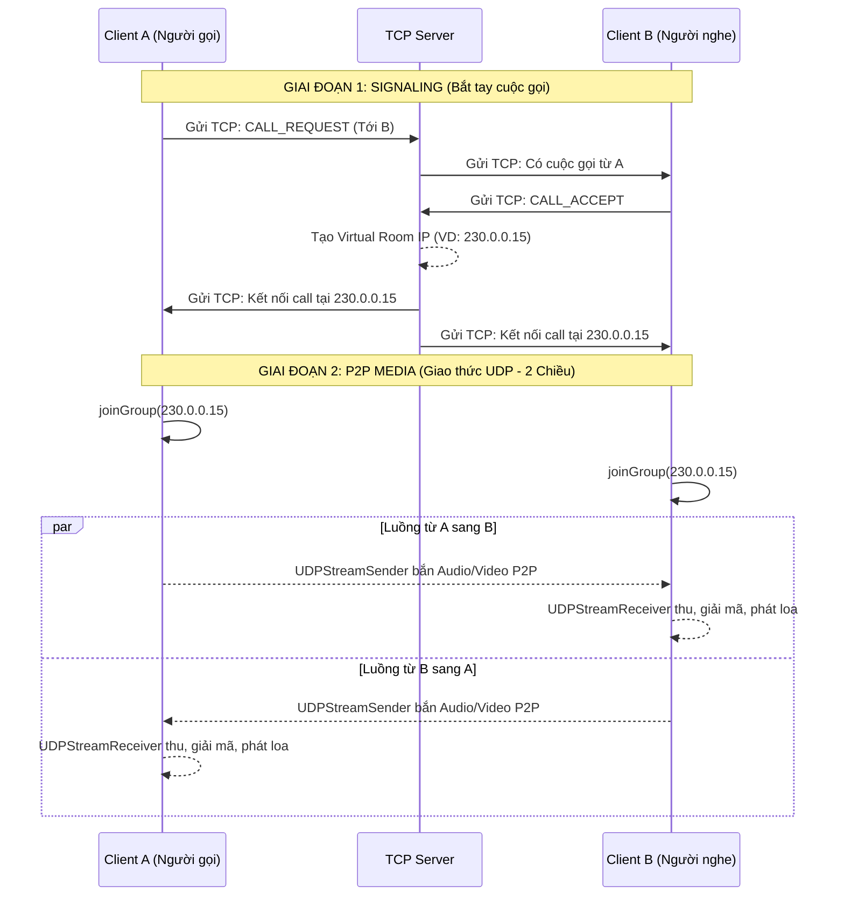
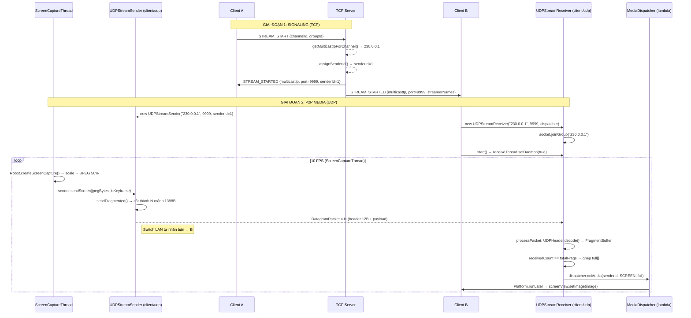

# Luồng Hoạt Động UDP Multicast P2P (LANCord)

Tài liệu này mô tả chi tiết cách LANCord kết hợp **TCP Server (Signaling)** và **UDP Multicast (P2P Media)** để xử lý luồng Video/Audio trong hai trường hợp: Share màn hình trong Group (General) và Gọi điện 1-1 (Direct Message).

---

## 1. Bản chất kiến trúc: Signaling vs Data
Kiến trúc luồng (Stream) trong LANCord tách biệt hoàn toàn giữa việc **"Điều khiển"** và việc **"Truyền dữ liệu"**:
- **Control Plane (TCP Server):** Đóng vai trò là Signaling Server. Chỉ quản lý việc cấp phát địa chỉ IP Multicast (ví dụ `230.0.0.x`) và báo cho các Client biết cần kết nối vào đâu. **KHÔNG** trung chuyển dữ liệu Video/Audio.
- **Data Plane (UDP Multicast):** Hoạt động P2P hoàn toàn. Các Client tự động bắn/nhận dữ liệu trực tiếp với nhau thông qua mạng LAN cục bộ dựa trên IP Multicast đã được Server cấp.

---

## 2. Kịch bản 1: Share màn hình trong General Chat (Group)

Đặc điểm: Truyền dữ liệu 1 chiều (1 người gửi, N người nhận). IP Multicast gán cố định cho Group.

### Sơ đồ luồng (Sequence Diagram)



---

## 3. Kịch bản 2: Gọi điện thoại 1-1 (Direct Message)

Đặc điểm: Truyền dữ liệu 2 chiều (Duplex). IP Multicast được tạo ra như một phòng riêng (Private Room) tạm thời cho 2 người.

### Sơ đồ luồng (Sequence Diagram)



---

## 4. Giải phẫu chi tiết mã nguồn

> ⚠️ **Lưu ý quan trọng:** Project có 2 package UDP — `client/network/` (code cũ, không sử dụng) và `client/udp/` (code thực tế đang chạy). `MainController.java` import từ `client.udp.*`. Mọi mô tả dưới đây dựa trên **`client/udp/`**.

### 4.1 UDPStreamSender (`client/udp/UDPStreamSender.java`)

Sender **không** tự chụp màn hình. Trách nhiệm của nó chỉ là **nhận byte thô và phân mảnh rồi gửi đi**. Việc thu thập dữ liệu do 3 thread riêng đảm nhiệm.

```
Khởi tạo: UDPStreamSender(multicastIp, port, senderId)
├─ socket = new MulticastSocket()              ← Không kết nối Server
├─ group  = InetAddress.getByName(multicastIp) ← IP do TCP Server cấp
├─ socket.setTimeToLive(32)                    ← Giới hạn phạm vi LAN
└─ seqIdCounter = new AtomicInteger(0)         ← Đếm số thứ tự frame

3 Thread nguồn gọi vào Sender:
├─ ScreenCaptureThread  → sender.sendScreen(jpegBytes, isKeyframe)
├─ WebcamCaptureThread  → sender.sendWebcam(jpegBytes, isKeyframe)
└─ AudioCaptureThread   → sender.sendAudio(pcmBytes)

sendFragmented(mediaType, data, isKeyframe):
├─ totalFrags = ceil(data.length / 1388)
├─ seqId = seqIdCounter.getAndIncrement() & 0xFFFF
│
└─ FOR i = 0..totalFrags-1:
    ├─ flags = FLAG_IS_FRAGMENT (0x01)
    │   if i == last:   flags |= FLAG_IS_LAST_FRAGMENT (0x02)
    │   if isKeyframe:  flags |= FLAG_IS_KEYFRAME      (0x04)
    │
    ├─ header = UDPHeader.encode(mediaType, flags, seqId,
    │                            fragIndex=i, totalFrags,
    │                            payloadLen, senderId)
    │   → 12 bytes BIG_ENDIAN:
    │   [mediaType:1B][flags:1B][seqId:2B][fragIndex:2B]
    │   [totalFrags:2B][payloadLen:2B][senderId:1B][reserved:1B]
    │
    ├─ packet = header(12B) + payload(≤1388B)
    └─ socket.send(new DatagramPacket(packet, ..., group, port))
```

### 4.2 UDPStreamReceiver (`client/udp/UDPStreamReceiver.java`)

```
Khởi tạo: UDPStreamReceiver(multicastIp, port, dispatcher)
├─ socket = new MulticastSocket(port)
├─ socket.setReuseAddress(true)
├─ socket.joinGroup(group)           ← Đăng ký nhận gói Multicast từ LAN
└─ staleCleanup = ScheduledExecutor  ← Dọn rác mỗi 500ms

start():
├─ receiveThread = new Thread(this::receiveLoop)
│   receiveThread.setDaemon(true)    ← Không block JVM tắt
└─ staleCleanup.scheduleAtFixedRate(cleanStaleBuffers, 500ms)

receiveLoop():
└─ while(running):
    socket.receive(pkt)              ← Blocking, chờ gói UDP từ mạng
    processPacket(pkt)

processPacket(pkt):
├─ if pkt.length < 12: return        ← Bỏ gói dị dạng
├─ h = UDPHeader.decode(data)        ← Giải mã 12-byte header
├─ payload = data[12 .. 12+payloadLen]
├─ key = senderId + ":" + seqId      ← Định danh duy nhất cho 1 frame
│
├─ IF totalFrags == 1:               ← Gói nhỏ (audio ≤1388B)
│   dispatcher.onMedia(senderId, mediaType, payload)
│   return
│
└─ ELSE (gói lớn, cần ghép mảnh):
    buf = fragmentMap.computeIfAbsent(key, k → new FragmentBuffer(h))
    synchronized(buf):
        buf.fragments[fragIndex] = payload
        buf.receivedCount++
        if receivedCount == totalFrags:
            full = nối tất cả buf.fragments[]
            fragmentMap.remove(key)
            dispatcher.onMedia(senderId, mediaType, full)

cleanStaleBuffers() [mỗi 500ms]:
└─ fragmentMap.removeIf(entry → now - entry.createdAt > 2000ms)
   ← Dọn frame chưa hoàn tất do mất gói UDP (frame-skip)

MediaDispatcher.onMedia(senderId, mediaType, full):
[Lambda định nghĩa trong MainController]
├─ MEDIA_AUDIO  (0x00): audioRenderers.get(senderId).enqueue(full)
│                         → SourceDataLine.write() phát ra loa
├─ MEDIA_WEBCAM (0x01): Platform.runLater(() → webcamView.setImage(...))
└─ MEDIA_SCREEN (0x02): Platform.runLater(() → screenView.setImage(...))
```

---

### 4.3 Cập nhật sơ đồ Group Share (chính xác theo code)



