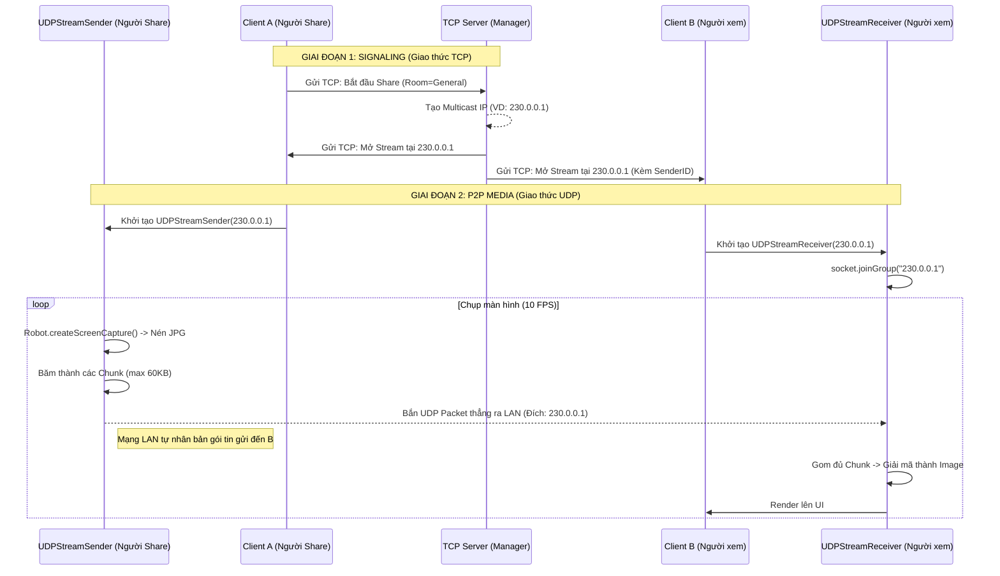
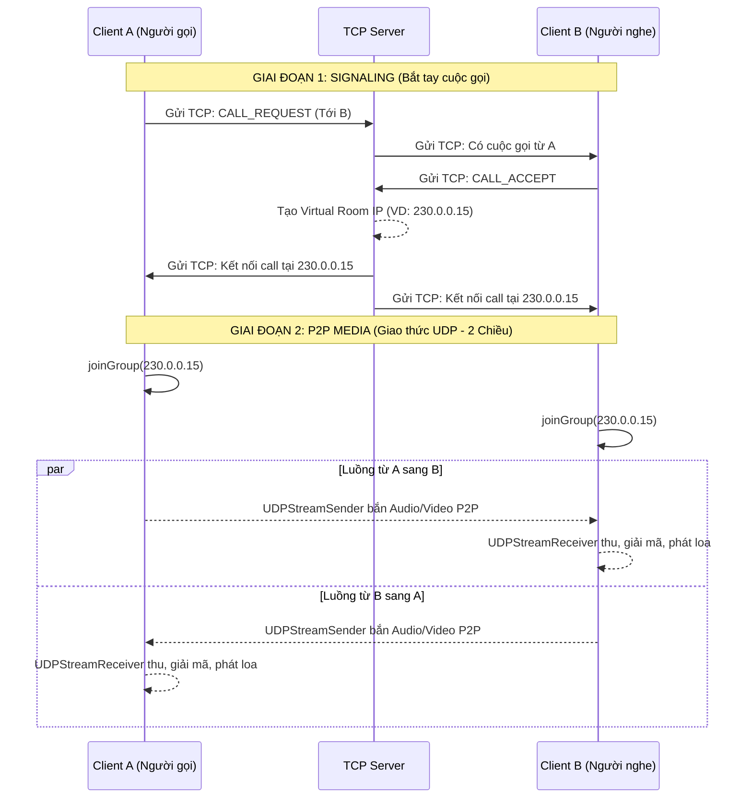

# Luồng Hoạt Động UDP Multicast P2P (LANCord)

Tài liệu này mô tả chi tiết cách LANCord kết hợp **TCP Server (Signaling)** và **UDP Multicast (P2P Media)** để xử lý luồng Video/Audio trong hai trường hợp: Share màn hình trong Group (General) và Gọi điện 1-1 (Direct Message).

---

## 1. Bản chất kiến trúc: Signaling vs Data
Kiến trúc luồng (Stream) trong LANCord tách biệt hoàn toàn giữa việc **"Điều khiển"** và việc **"Truyền dữ liệu"**:
- **Control Plane (TCP Server):** Đóng vai trò là Signaling Server. Chỉ quản lý việc cấp phát địa chỉ IP Multicast (ví dụ `230.0.0.x`) và báo cho các Client biết cần kết nối vào đâu. **KHÔNG** trung chuyển dữ liệu Video/Audio.
- **Data Plane (UDP Multicast):** Hoạt động P2P hoàn toàn. Các Client tự động bắn/nhận dữ liệu trực tiếp với nhau thông qua mạng LAN cục bộ dựa trên IP Multicast đã được Server cấp.

---

## 2. Kịch bản 1: Share màn hình trong General Chat (Group)

Đặc điểm: Truyền dữ liệu 1 chiều (1 người gửi, N người nhận). IP Multicast gán cố định cho Group.

### Sơ đồ luồng (Sequence Diagram)

---

## 3. Kịch bản 2: Gọi điện thoại 1-1 (Direct Message)

Đặc điểm: Truyền dữ liệu 2 chiều (Duplex). IP Multicast được tạo ra như một phòng riêng (Private Room) tạm thời cho 2 người.

### Sơ đồ luồng (Sequence Diagram)

---

## 4. Giải phẫu chi tiết mã nguồn Gửi (UDPStreamSender)

Theo đoạn mã nguồn ở file `UDPStreamSender.java` (dòng 16-40), luồng xử lý bên trong một phiên Sender diễn ra như sau:

1. **Khởi tạo (Khôn ngoan):** `socket = new MulticastSocket();` 
   -> Không cần IP Server. Chỉ cần lấy quyền mở port UDP.
2. **Xác định đích đến:** `InetAddress group = InetAddress.getByName(multicastIp);`
   -> Địa chỉ này là do TCP Server (Signaling) cấp thông qua tin nhắn TCP.
3. **Chụp hình liên tục (Vòng lặp `while(streaming)`):**
   -> Dùng `java.awt.Robot` để chụp toàn màn hình.
4. **Nén hình (Quan trọng):**
   -> Dùng `ImageIO` nén ảnh về định dạng `JPG`. Ảnh RAW rất nặng, ép về JPG là để tránh quá tải buffer UDP mạng LAN.
5. **Cắt mảnh (Chunking):**
   -> Gói tin UDP tối đa là 64KB, file JPG lớn hơn nên phải cắt thành các mảnh (Chunks) nhỏ (tối đa 60KB).
   -> Header 8-byte được gắn vào đầu mỗi chunk: `[TotalChunks (4 bytes)] + [ChunkIndex (4 bytes)]` để máy người xem (Receiver) biết thứ tự mà nối lại thành 1 ảnh hoàn chỉnh.
6. **Bắn ra mạng:** `socket.send(packet);`
   -> Chỉ cần gọi lệnh này 1 lần. Công việc còn lại do Switch phần cứng ở giữa lo liệu. Đảm bảo mô hình P2P Group được vận hành mượt mà.
